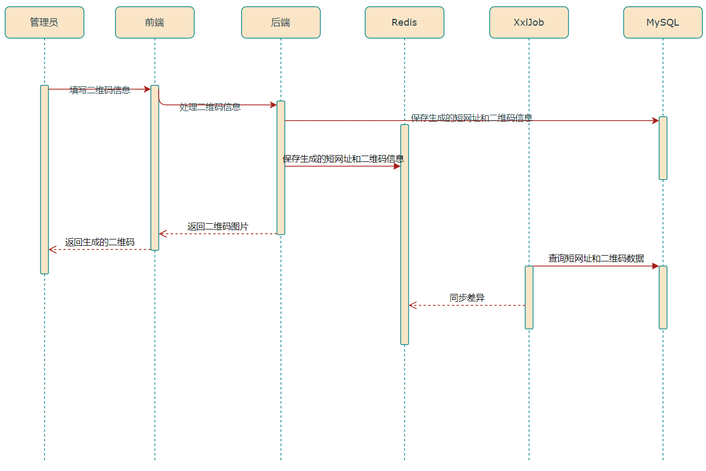
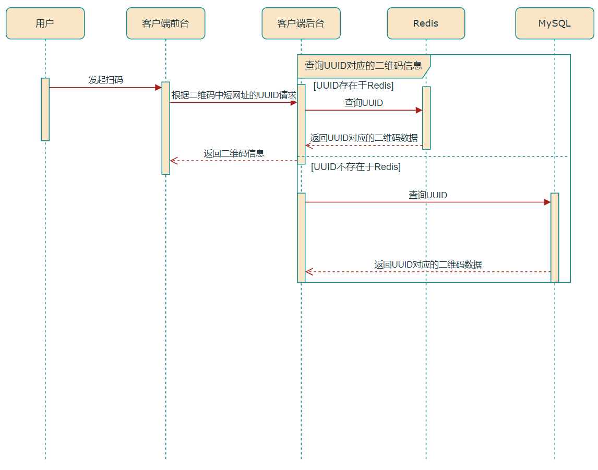

    <h3 style="font-size: 25px;font-weight: 600;letter-spacing: 1px;text-transform: uppercase;margin: 0;">
       Dynamic QR Code
    </h3>
    
    	动态二维码
    

## 简介

​	本项目主要实现生成二维码活码的功能，何为二维码活码，即根据需要的信息，生成二维码后，信息可修改，二维码图片不会改变，在修改信息后，第一次生成的二维码还可以扫，扫出来的信息会跟着变动

## 前端技术栈

- React
- Vite
- TypeScript
- Ant Design
- Axios

## 后端技术栈

- Java
- Spring boot
- Redis
- Mysql
- QuartZ

## 时序图

### 服务端

### 客户端

